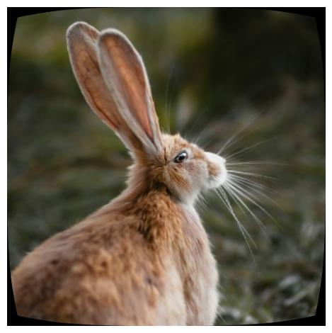

<div align="center">
    
</div>

<div align="center">
    <a href="#">
        
    </a>
    <a href="https://github.com/serre-lab/Warped/actions/workflows/lint.yml/badge.svg">
        
    </a>
    <a href="https://github.com/serre-lab/Warped/actions/workflows/tox.yml/badge.svg">
        
    </a>
    <a href="https://github.com/serre-lab/Warped/actions/workflows/publish.yml/badge.svg">
        
    </a>
    <a href="https://pepy.tech/project/torqueo">
        
    </a>
    <a href="#">
        
    </a>
</div>

**Torqueo** is a simple and hackable library for experimentation with image warping in **PyTorch**. It is designed to facilitate easy manipulation and transformation of images using various warping techniques.


# 🚀 Getting Started with Torqueo

**Torqueo** requires **Python 3.7** or newer and several dependencies, including **Numpy**. Installation is straightforward with **Pypi**:

```bash
pip install torqueo
```

With **Torqueo** installed, you can dive into image warping. The API is designed to be **intuitive**, requiring only a few hyperparameters to get started.

Example usage:

```python
import torch
import timm
from torqueo import Fisheye

transformed_images = Fisheye()(images)
```

**Starter Notebook:** <a href="https://colab.research.google.com/drive/1X_DuMAWEwE1GRMc7kyTIIg4xiiQWVJo3?usp=sharing" target="_blank"></a>

# Examples of transformations

Below are some examples of image transformations using **Torqueo**.

|  |  |  |
|-|-|-|
| <br> **Original Image** | <br> **Barrel** | <br> **Fisheye**|
| <br> **Perspective** | <br> **Pinch** | <br> **Spherize**|
| <br> **Stretch** | <br> **Swirl** | <br> **Twirl**|
| <br> **Wave** | | |

# Authors of the code

- [**Vipul Sharma**]() - vipul_sharma@brown.edu, Brown University
- [**Thomas Fel**](https://thomasfel.fr) - thomas_fel@brown.edu, PhD Student DEEL (ANITI), Brown University
