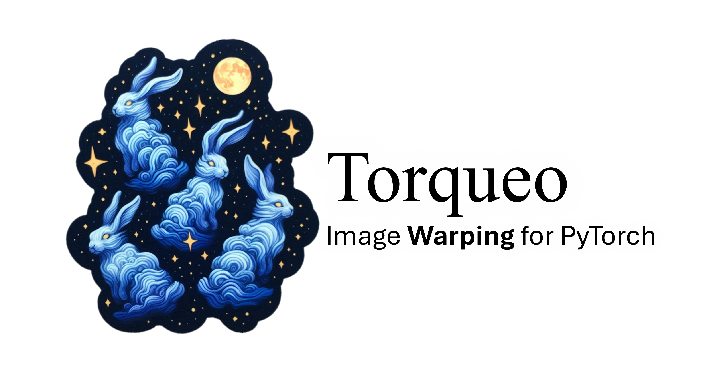
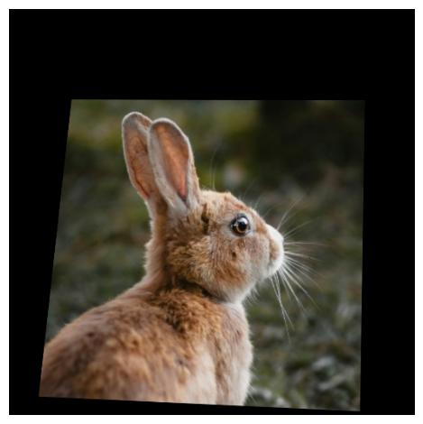

<div align="center">
    
</div>


# 🚀 Getting Started with Torqueo

Torqueo requires Python 3.6 or newer and several dependencies, including Numpy. Installation is straightforward with Pypi:

```bash
pip install torqueo
```

With Torqueo installed, you can dive into image warping. The API is designed to be intuitive, requiring only a few hyperparameters to get started.

Example usage:

```python
import torch
import timm
from torqueo import Fisheye

@tfel todo
```

# Examples of transformations

Below are some examples of image transformations using Torqueo.

|  |  ||
|----------------|----------------|----------------|
| <br> Original Image | <br> Barrel | <br> Fisheye  |
| <br> Perspective  | <br> Pinch  | <br> Spherize  |
| <br> Stretch  | <br> Swirl  | <br> Twirl  |
| <br> Wave  |   |   |


# Authors of the code

- [Thomas Fel](https://thomasfel.fr) - thomas_fel@brown.edu, PhD Student DEEL (ANITI), Brown University
- [Vipul Sharma]() - vipul_sharma@brown.edu, Brown University